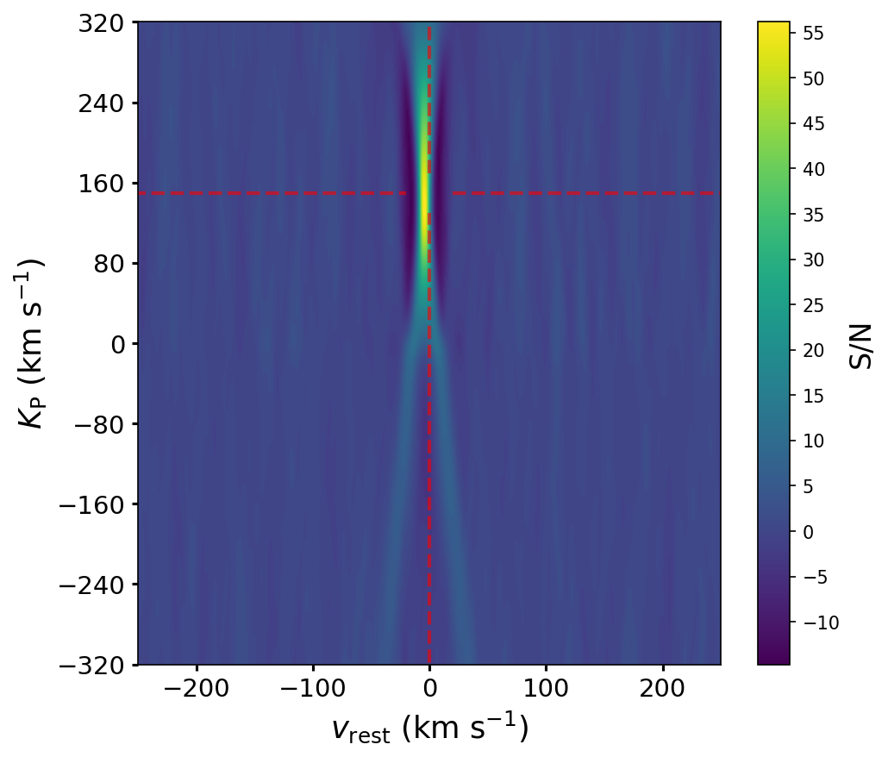
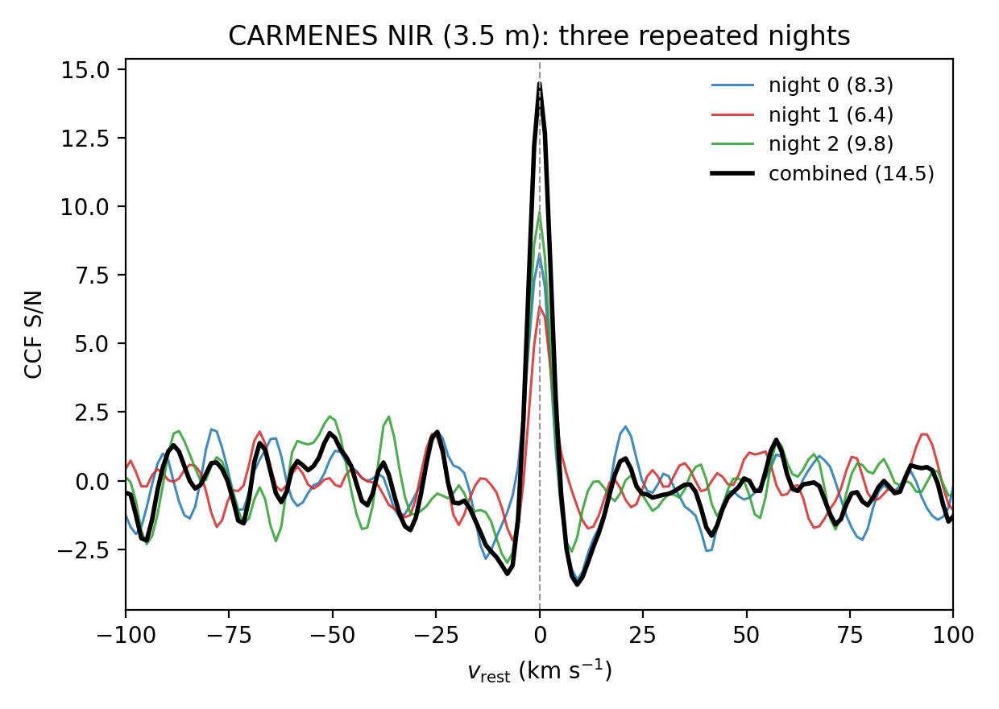
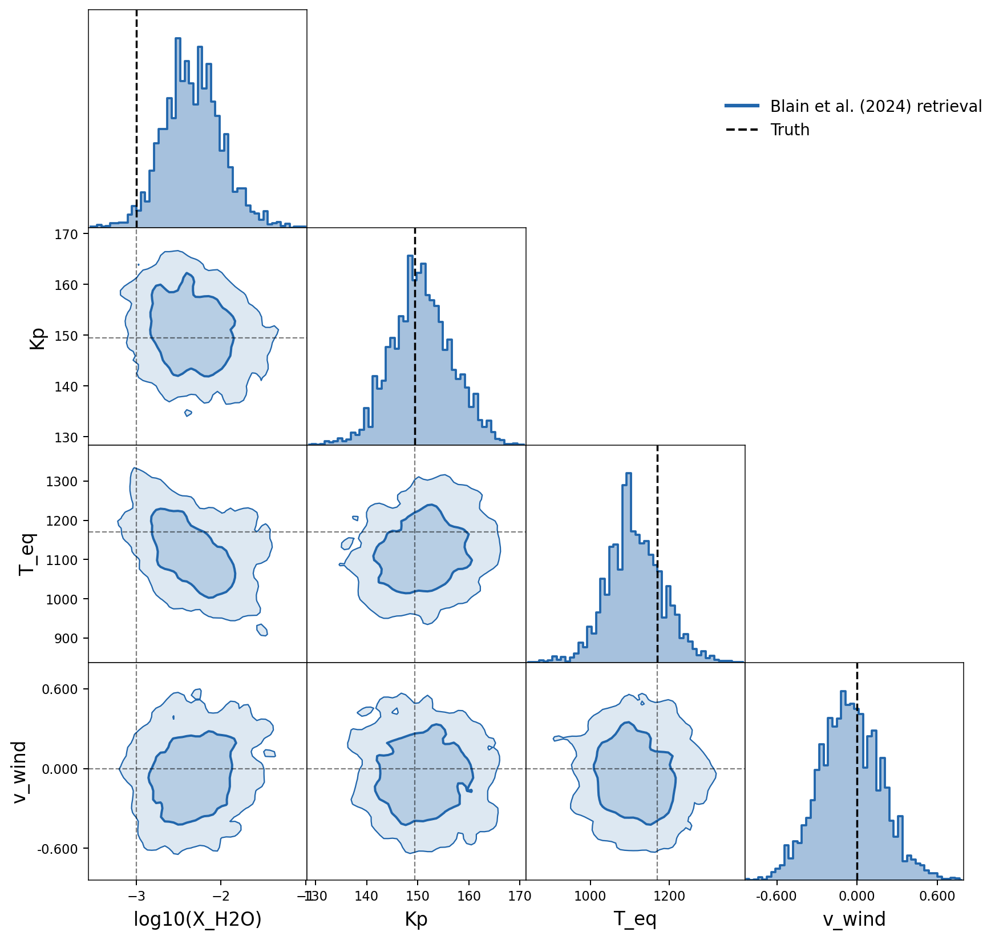
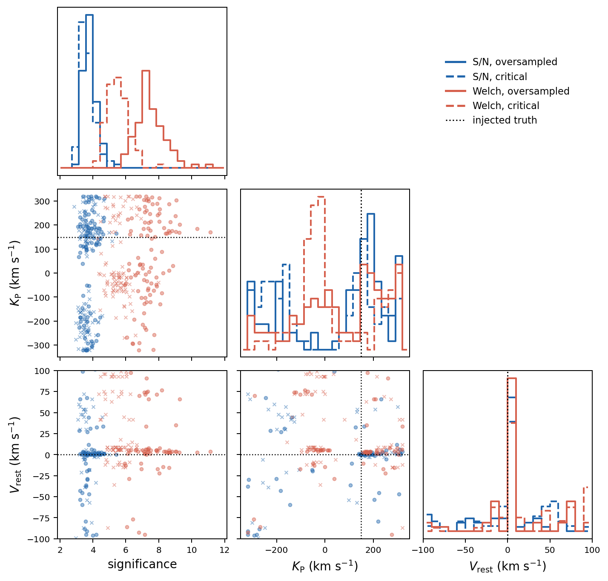

# EXoPLORE

[](https://exoplore.readthedocs.io/en/latest/)

**High-Resolution Exoplanet Atmosphere Simulator and Retrieval Framework**

EXoPLORE is a Python framework for simulating and analysing this kind of
observation end to end. It builds a full atmospheric forward model
([petitRADTRANS](https://petitradtrans.readthedocs.io) + [EasyChem](https://easychem.readthedocs.io)) in a 1D **or pseudo-2D** approach, adds realistic
per-exposure telluric contamination and instrument noise for several
spectrographs, removes systematics with a choice of literature preparation
pipelines, and produces inverse-variance weighted cross-correlation and
Kp-Vsys detection maps, multi-night co-addition, and optional Bayesian
retrievals ([MultiNest](https://github.com/JohannesBuchner/PyMultiNest) or [emcee](https://emcee.readthedocs.io)). A single JSON config drives everything, and
the same configuration applies equally to fully synthetic data and to real
observed spectra.

> **New to the technique?** Start with the
> [Concepts primer](https://exoplore.readthedocs.io/en/latest/concepts.html),
> a self-contained introduction to the Doppler trick, cross-correlation,
> Kp-Vsys maps, the choice of likelihood (with a worked proof of why it
> matters), and the precision-versus-accuracy problem. It assumes little prior HRS
> experience.

> **Note:** this is an early public release. The legacy code adaptation to a modular, easier to use (for someone other than me... =D) version takes a bit of time. The documentation is actively being expanded and plots/discussion will change; feedback and suggestions are welcome via the [issue tracker](https://github.com/asanchezlopezIAA/EXoPLORE/issues).

---

## What EXoPLORE produces

<table>
<tr>
<td width="50%"></td>
<td width="50%"></td>
</tr>
<tr>
<td align="center"><b>Kp-Vsys detection map.</b> H<sub>2</sub>O detected at ~43σ in a single simulated ANDES transit of HD 189733 b, recovered at the correct orbital and rest velocity.</td>
<td align="center"><b>Multi-night co-addition.</b> Three CARMENES NIR nights of HD 189733 b combine to a higher significance than any single night, close to the √N gain expected for photon-limited noise.</td>
</tr>
<tr>
<td width="50%"></td>
<td width="50%"></td>
</tr>
<tr>
<td align="center"><b>Bayesian atmospheric retrieval.</b> Posterior distributions for a Blain24 retrieval of a single noiseless CARMENES NIR order of HD 189733 b; the water abundance, K<sub>P</sub>, T<sub>eq</sub>, and V<sub>rest</sub> are all recovered at the injected truth values (red lines).</td>
<td align="center"><b>Statistical validation over 100 noise realisations.</b> Distributions of the recovered significance, K<sub>P</sub>, and V<sub>rest</sub> for the same injected HD 189733 b atmosphere (ANDES, single order), comparing the S/N and Welch metrics at two cross-correlation velocity steps.</td>
</tr>
</table>

---

## Scientific workflow

```
Planet / system parameters
        ↓
Instrument and observing setup
        ↓
Atmospheric forward model  (petitRADTRANS + EasyChem; 1D or pseudo-2D limbs)
        ↓
Stellar + planetary + telluric + instrumental effects
        ↓
Time-series spectral observations  (synthetic, or load real spectra)
        ↓
Data preparation, telluric masking, systematics removal
        ↓
Cross-correlation analysis  (inverse-variance weighted CCF)
        ↓
Kp-Vsys detection maps  and/or  atmospheric retrieval  (MultiNest / emcee)
```

---

## Installation

### Requirements

- Python 3.10 or later
- [petitRADTRANS](https://petitradtrans.readthedocs.io), Mollière et al. (2019, [A&A 627, A67](https://doi.org/10.1051/0004-6361/201935470))
- [EasyChem](https://easychem.readthedocs.io), Lei & Mollière (2024, [arXiv:2410.21364](https://arxiv.org/abs/2410.21364))
- [BATMAN](https://lkreidberg.github.io/batman/docs/html/index.html), Kreidberg (2015, [PASP 127, 1161](https://doi.org/10.1086/683602))
- [PHOENIX stellar models](https://phoenix.astro.physik.uni-goettingen.de), Husser et al. (2013, [A&A 553, A6](https://doi.org/10.1051/0004-6361/201219058)); download the wave grid and the flux file matching your target star
- A Fortran compiler (gfortran) is required to build petitRADTRANS and EasyChem
- petitRADTRANS opacity tables (several GB); see [docs/input_files.md](docs/input_files.md)
- For [SkyCalc](https://skycalc-ipy.readthedocs.io) telluric generation (optional, Mode 2 only): [skycalc_ipy](https://skycalc-ipy.readthedocs.io), Noll et al. (2012, [A&A 543, A92](https://doi.org/10.1051/0004-6361/201219040)); [astroplan](https://astroplan.readthedocs.io), Morris et al. (2018, [AJ 155, 128](https://doi.org/10.3847/1538-3881/aaa47e))
- For Bayesian retrieval (optional): [PyMultiNest](https://github.com/JohannesBuchner/PyMultiNest), Feroz et al. (2009, [MNRAS 398, 1601](https://doi.org/10.1111/j.1365-2966.2009.14548.x)); [emcee](https://emcee.readthedocs.io), Foreman-Mackey et al. (2013, [PASP 125, 306](https://doi.org/10.1086/670067)); [corner](https://corner.readthedocs.io), Foreman-Mackey (2016, [JOSS 1, 24](https://doi.org/10.21105/joss.00024))

### Step-by-step

```bash
# 1. Clone the repository
git clone https://github.com/asanchezlopezIAA/EXoPLORE.git
cd EXoPLORE

# 2. Create and activate a virtual environment
python -m venv .venv
source .venv/bin/activate

# 3. Install the package and Python dependencies
pip install -e ".[dev]"

# 4. Install scientific dependencies (require a Fortran compiler)
#    macOS: set the SDK path first
export SDKROOT="$(xcrun --show-sdk-path)"
pip install petitRADTRANS easychem batman-package
```

On macOS, the `export SDKROOT` line is required every terminal session before importing petitRADTRANS or EasyChem. We recommend adding it to `~/.zshrc` or `~/.bashrc`.

### Verify

```bash
python -m pytest
```

All tests should pass. A small number of `RuntimeWarning`s from NumPy and SciPy are expected and harmless.

---

## Quick start

EXoPLORE is controlled entirely by a JSON config file. To preview a simulation without computing anything:

```bash
python scripts/run_exoplore.py configs/hd189733b_andes_transit_clean.json
```

To execute it:

```bash
python -u scripts/run_exoplore.py configs/hd189733b_andes_transit_clean.json --run 2>&1 | tee run.log
```

The `--run` flag is required to actually simulate. Without it, the simulator prints a summary and exits (useful for catching configuration errors quickly).

The summary printed on every run:

```
EXoPLORE Simulation Summary
============================
Planet              : HD189733b
Instrument          : ANDES_YJHK
Event               : transit
Nights              : 1
Pipeline            : BL19 (Brogi & Line 2019, AJ, 157, 114)
Species             : ['H2O', 'CO', 'CH4', 'NH3', ...]
EasyChem            : True
C/O                 : 0.41
Metallicity (log Z) : 0.53
CCF v_max (km/s)    : 325.0
Retrieval           : False
Output root         : outputs
```

---

## Documentation

| Document | Contents |
|---|---|
| [docs/concepts.md](docs/concepts.md) | **Start here if new to HRS.** The Doppler trick, the forward model, preparation pipelines, cross-correlation and Kp-Vsys maps, the choice of likelihood (with a worked proof), detection significance, and precision versus accuracy |
| [docs/tutorial.md](docs/tutorial.md) | Step-by-step first simulation, changing planets and species, CARMENES run, multi-night stacking (ANDES and CARMENES), Bayesian retrieval, pipeline unbiasedness testing |
| [docs/config_reference.md](docs/config_reference.md) | Every configuration field with units, valid values, and physical meaning |
| [docs/outputs.md](docs/outputs.md) | Output file layout, selecting which matrices to write (disk usage), how to read Kp-Vsys maps, CCF matrices, retrieval products |
| [docs/input_files.md](docs/input_files.md) | Required input files, download instructions, directory layout per instrument |
| [docs/data_acknowledgements.md](docs/data_acknowledgements.md) | Citation text for bundled datasets (CARMENES reference night, SkyCalc, PHOENIX) |

---

## Configuration

All simulation choices are controlled by a JSON file. Copy and edit the provided example:

```bash
cp configs/hd189733b_andes_transit_clean.json configs/my_simulation.json
```

The main configuration sections are:

| Section | What it controls |
|---|---|
| `planet` | Planet name and path to the planet parameter JSON |
| `instrument` | Instrument name, resolving power, detector layout, order selection |
| `observation` | Event type (`transit`/`dayside`), exposure time, number of nights |
| `atmosphere` | Molecular species, EasyChem flag, C/O, metallicity, T-P profile, limb asymmetries, winds |
| `tellurics` | SkyCalc options, PWV, airmass grid, masking threshold |
| `pipeline` | Preparing pipeline recipe, SYSREM iterations, SNR mask, normalisation |
| `cross_correlation` | Velocity range and step, Kp map bounds |
| `retrieval` | Sampler, log-likelihood, prior bounds per parameter space |
| `plotting` | Diagnostic figure settings (e.g., wavelength window for the pipeline-steps plot) |
| `paths` | Output root, planet parameter directory, petitRADTRANS data path |

Runtime for the reference HD 189733 b ANDES simulation (76 orders, 1 night) is approximately 20 to 60 minutes on a modern desktop, dominated by petitRADTRANS opacity loading and the CCF computation. To test with a small subset of orders first, set `instrument.order_indices: [0, 5, 10]`.

---

## Package structure

```
src/exoplore/
├── config/         SimulationConfig and all sub-configs (typed dataclasses)
├── core/           High-level orchestration (simulator, CLI)
├── planets/        Planet system parameters
├── atmosphere/     Atmospheric physics (petitRADTRANS wrappers, winds, chemistry)
├── instruments/    Instrument models (ANDES, CARMENES, CRIRES+)
├── observation/    Observing geometry (phase, timing, velocity, noise)
├── pipelines/      Data preparation (BL19, Blain24, ASL19, Gibson22, SYSREM)
├── ccf/            Cross-correlation framework (CCF kernels, Kp-Vsys maps)
├── plotting/       Diagnostic figures (Kp-Vsys maps, pipeline-steps, CCF trail)
└── io/             File I/O utilities

configs/            Example simulation configuration files
planet_params/      Planet system parameter JSON files
scripts/            run_exoplore.py, make_planet_params.py
tests/              pytest test suite
```

---

## Adding a new planet

All planet parameters live in a single JSON file. No code changes are required to add a new target. To generate the file from a template:

```bash
python scripts/make_planet_params.py
```

Edit the `USER INPUT` block at the top of the script with the planet's parameters. The script computes `kp_kms` automatically from the orbital geometry and writes the JSON to `planet_params/`. Alternatively, copy `planet_params/HD189733b.json` and fill in the fields manually. To reference it in a simulation config:

```json
"planet": { "name": "WASP-76b", "parameter_file": "planet_params/wasp76b.json" }
```

---

## Adding a new instrument

i) Create `src/exoplore/instruments/my_instrument.py` implementing `get_instrument_info()`. Follow the pattern in `instruments/carmenes_nir.py` or `instruments/andes.py`.

ii) Add one entry to `_REGISTRY` in `src/exoplore/instruments/__init__.py`:
```python
"MY_INSTRUMENT": my_module.get_instrument_info,
```

iii) Set `"instrument": { "name": "MY_INSTRUMENT" }` in the config and provide the required input files.

iv) Add a test in `tests/test_instruments.py` and document the input files in `docs/input_files.md`.

---

## Citation

If you use EXoPLORE in your research, please cite the primary reference
(end-to-end simulator, 2D retrieval framework, ANDES detectability studies):

> Sánchez-López, A., Pallé, E., & Millán, A. P. (2026).
> *Resolving inhomogeneous hot and ultra-hot Jupiter atmospheres with ANDES:
> insights from simulated ELT observations.*
> A&A, submitted.

If your work builds on the published applications, please also cite the
relevant one:

> Peláez-Torres, A., Sánchez-López, A., Nortmann, L., et al. (2026).
> *Tighter constraints on the atmosphere of GJ 436 b from combined
> high-resolution CARMENES and CRIRES+ observations.*
> A&A, 705, A256.
> doi: [10.1051/0004-6361/202557570](https://doi.org/10.1051/0004-6361/202557570)

> Peláez-Torres, A., Sánchez-López, A., Jiang, C., et al. (2026).
> *Atmospheric constraints on GJ 1214 b from CRIRES+ and prospects for
> characterisation with ANDES.*
> A&A, 708, A184.
> doi: [10.1051/0004-6361/202558426](https://doi.org/10.1051/0004-6361/202558426)

Please also cite the underlying tools relevant to your analysis, in particular:

> Mollière, P. et al. (2019), *petitRADTRANS*, A&A, 627, A67  
> Lei, E. & Mollière, P. (2024), *EasyChem*, arXiv:2410.21364  
> Kreidberg, L. (2015), *batman*, PASP, 127, 1161

---

## Contributing

Contributions are welcome. Please open an issue before submitting a pull request so the change can be discussed.

---

## Data acknowledgements

The CARMENES reference-night files for HD 189733 b (2017-09-07) are deposited on Zenodo:
**[doi:10.5281/zenodo.20613621](https://doi.org/10.5281/zenodo.20613621)**.
Download the 30 FITS files into `inputs/CARMENES_NIR/HD189733b/reference_night/`
before running the CARMENES tutorials. See [docs/installation.md](docs/installation.md) for details.

If you use these files in published work, please consider citing
**Alonso-Floriano et al. (2019, A&A 621, A74)**, **Sánchez-López et al. (2019, A&A 630, A53)**, and **Blain, Sánchez-López & Mollière (2024, AJ 167, 179)**, and including the following acknowledgement:

> Based on data from the CAHA Archive at CAB (INTA-CSIC). The CAHA Archive is
> part of the Spanish Virtual Observatory project funded by
> MCIN/AEI/10.13039/501100011033 through grant PID2023-146210NB-I00.

---

## License

EXoPLORE is available under the MIT License (see `LICENSE` for details).

---

## Author

Alejandro Sánchez-López  
Instituto de Astrofísica de Andalucía (IAA-CSIC), Granada, Spain  
[alexsl@iaa.es](mailto:alexsl@iaa.es)
